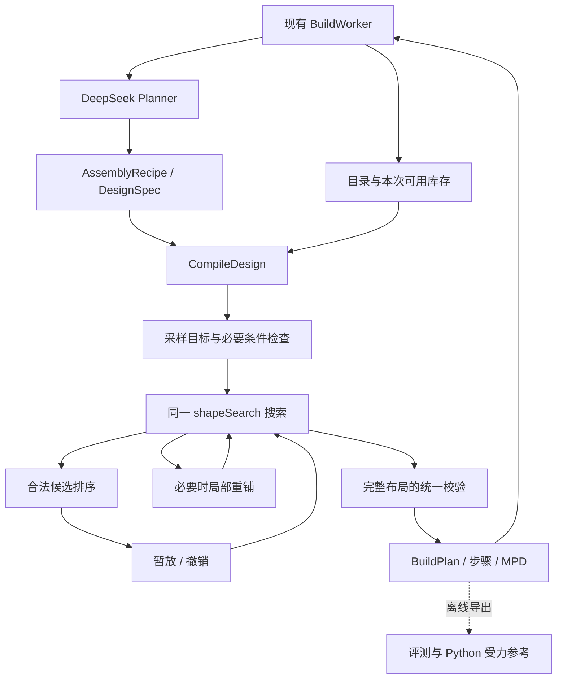

# BrickGPT 算法在 Chimii Build 中的 Go 集成设计

日期：2026-09-09。实施基线：`6e987e0`。本文保留原始方案；执行结果、实验取舍与验证边界见 [实施验收记录](brickgpt-go-implementation.md)。

## 1. 架构决策

在 `server/internal/build` 内继续完善一个确定性的积木编译器。DeepSeek 输出需求和目标形状，编译器处理真实零件、布局搜索和有限修复，现有校验器决定是否接受。复用 BrickGPT 的算法思想和可验证的计算方法，不复制其整个运行栈。

这里的架构质量由四件事衡量：同一数据只保留一个权威表示，业务约束不能被算法绕过，计算成本有明确边界，改进效果可以用同一批输入复现。

本期保留一个 Go 包、一条编译流程、一个最终验收入口。采用普通函数和少量私有结构体；不增加微服务、插件系统、求解器注册中心或通用工作流引擎。`server/runtime` 的 Agent 框架继续承担原有职责。

## 2. 当前已经具备什么

以下均已按本轮源码核对，而非待建能力：

| 能力 | 现有位置 | 本方案处理方式 |
| --- | --- | --- |
| 任务、模型调用、目录与库存读取、作品完成 | `server/internal/handler/build_worker.go`、`build_planner.go` | 保持职责，算法不访问这些基础设施 |
| 结构化目标与采样 | `server/internal/build/design.go` | 复用 `DesignSpec` 和 `designTarget` |
| 目录零件与认证语义 | `catalog.go`、`mechanics.go`；`internal/ldrawsync` | 不复制 BrickGPT 的零件编号体系 |
| 确定性铺砖与回溯 | `shape-solver.go` | 继续使用 `shapeSearch` |
| 连续砖缝、关键邻域选择 | `shape-seams.go` | 首批 Go 实现已存在 |
| 两块重铺与最多八块邻域重铺 | `shape-repair.go` | 在现有实现上收敛预算和验证边界 |
| 最终连接、碰撞、库存、支撑与重心检查 | `compiler.go`、`mechanics.go` | 继续作为统一验收 |
| 作品、步骤、MPD 与编辑来源 | `BuildPlan`、`BuildDocument`、`ldraw.go` | 保持数据协议和不可变作品语义 |
| 本地回归与上游对照 | `internal/buildeval`、`scripts/brickgpt-eval` | 继续作为评测入口 |

此前留存报告中，原有 100 案例为 59 接受、41 拒绝；另设的 80 个合成库存案例由 68 接受提升为 71，未出现接受结果退步。本轮读取了这些报告，没有重新运行测试；它们也不代表自然语言生成质量或生产验收。

当前接缝策略仅在已配置库存且首次布局未成功后的搜索中启用。自由选砖仍保留原来的六种方向尝试。这一边界有实际回归依据：全量替换排序曾导致环形或桥梁搜索退步，应继续保留，直到有足够证据支持扩大适用范围。

## 3. 运行结构与职责



`build` 包接收明确参数并返回结果，不读数据库、配置文件或环境变量，不请求模型，不启动 Python 子进程，不保存作品。`BuildWorker` 负责输入获取、取消与任务生命周期，调用已有 `CompileDesign`；特殊零件模块仍使用原有模块编译路径，最终都汇合到 `compilePlacements`。

不为了视觉上统一而修改所有编译函数签名。形状编译的调用链已携带 `context.Context`，本期沿用。参数编辑继续直接编译，不增加模型调用。

### 数据的唯一表示

| 数据 | 含义与所有权 |
| --- | --- |
| `DesignSpec` | 用户目标；本次编译只读，算法不能删形状、移动门洞或暗改尺寸 |
| `designTarget` | 按现有规则采样的体素及形状标识、目标颜色；一次编译生成一次，共享只读 |
| `PartCatalog` | 当前调用提供的真实零件及连接、占位语义；不另建 `BrickGPTPart` |
| `InventorySnapshot` | 沿用现有类型，作为本次可用数量的输入值；不是新增库存落库、预占或消耗 |
| `Placement` | 搜索、校验、步骤与导出的统一零件布局；不另建 Python 风格候选协议 |
| `BuildPlan` | 最终交付事实；只有完整校验通过的结果才能进入正常作品完成流程 |

保留当前单位：X/Z 为凸点格，Y 为薄板高度；一层普通砖高三层薄板。连接器继续使用现有 LDraw 单位转换。上游格式只在离线导入边界转换一次，不进入业务内核。

一次编译始终使用传入的目录与库存值，不在搜索中重读数据库，也不新增锁。作品仍保持不可变；编辑产生带来源的新作品和新进度。

## 4. 算法迁移范围

| 算法 | 来源与迁移方式 | 优先级 |
| --- | --- | --- |
| 非法候选拒绝 | 借鉴 BrickGPT 拒绝采样的原则，复用当前目录、占位和支撑过滤；不移植 token 采样器 | 当前必需 |
| 连续接缝优先 | 复用已实现的 `seamDepth` / `jointDepth`，衡量下一块砖跨接已有砖缝的价值 | 已接入，继续验证 |
| 连接组件优先 | 对合法候选，优先连接不同已有组件；局部修复时考虑保留的上层零件 | 已接入，继续验证 |
| 关键邻域重铺 | 从不连通接缝出发，重新安排有限零件，未改善就丢弃局部候选 | 已接入，继续完善 |
| 必要条件剪枝 | 根据目标体积、精确块数、剩余库存排除确定不可能的搜索分支 | 下一批可实施 |
| 力与力矩求解 | 继续使用离线 Python 参考，先统一边界条件、数值单位和验证样本 | 暂不移入产品 Go 内核 |
| Llama 推理、微调、纹理与 Blender | 与本期确定性编译器无关 | 不纳入本期 |

Go 实现的价值是业务约束和运行方式统一。它本身不会让错误的物理假设变正确，也不保证所有数值计算都比原实现快。

### 4.1 合法性过滤与候选排序分开

候选必须先满足现有硬条件：支持的目录零件、允许的姿态、完全落在目标体积内、没有占位重叠、保持形状标识、满足颜色规则、未超可用数量、具有足够的下方支撑。

颜色语义沿用现状：`ExactColors=true` 时严格保持指定颜色；否则只使用现有允许的库存配色规则，不把偏好颜色变成新的硬约束。

通过上述过滤后，分数才决定“先试哪块”：当前偏好颜色、连接组件、跨接深缝、覆盖体积和方向变化。第一步仅把分数计算整理成私有函数和有名称的常量，保留当前数值和稳定排序，不同时改成另一种评分体系。

暂不引入可配置权重面板、学习排序器或 `CandidateScorer` 接口。需要调权重时，固定同一语料做独立对照，并更新生成器版本。

候选期的占位接触可以辅助排序；最终“已经连接”的事实必须来自 `deriveExactConnections`。上层连接不能替代先前步骤提供的支撑。几何接近、连接组件数量和受力稳定是不同概念。

### 4.2 必要条件剪枝

复用同一个“可参与形状铺砖的零件”判定，供零件筛选、体积预检和候选枚举使用，防止三个环节各自维护略有差异的规则。

新增剪枝只使用可以证明的必要条件，例如：

- 剩余可用零件总体积小于尚未覆盖的体积。
- 精确数量还需要 N 块，但可用库存不足 N 块。
- 尚未覆盖体积为 V、可用零件最大体积为 M；若 `当前块数 + ceil(V/M)` 已超过精确块数，当前分支不能成功。M 为零时直接拒绝该分支。

最大体积必须来自当前允许且仍可用的零件，不能使用上游假定的长砖。上述估计可以保守，但不能错误排除有解分支。中间状态暂时不连通不是剪枝理由，后续横梁仍可能连接它们。

缺件等可证明条件与“预算内没搜到”分别记录。不能把必要条件估计、启发式低分或搜索失败写成“物理上不可能”。

### 4.3 有限局部修复

本期修复入口只处理有机会通过重铺解决的连通性问题。任意 `unstable_step`、未知零件或目录缺失都不能无差别交给一个万能修复器。

一次修复按以下顺序进行：

1. 从完整候选的真实连接图定位断开的组件和接缝。
2. 先尝试已有两块砖重铺，再根据适用策略选取最多八块的邻域。
3. 邻域外布局固定，邻域内可用数量由原库存扣除外部布局得到。
4. 复用同一候选生成和回溯算法，覆盖同一目标体素；不增加另一套铺砖器。
5. 只接受连通组件减少、未引入其他校验错误且目标不变量保持的结果；完整结果再经统一校验。
6. 失败丢弃临时搜索状态，原候选、目标和库存不变。

邻域选择建议使用稳定规则：优先接缝两侧，再按到接缝的距离、不同组件接触和固定的空间标识排序。先用现有面接触函数和小列表实现；没有性能证据前，不增加空间树或通用图引擎。

允许重铺后仍暂时存在多个组件，但必须比之前减少；轮数、单次搜索量和总计算量都有边界。限制值先沿用当前两块 160 节点、邻域 640 节点、最多八块和最多 48 轮，调整参数应单独评测。

## 5. 搜索预算与取消

当前 `shapeSearch` 同时维护 `visited`、`limit`、`budget`，外层累计搜索量，局部修复再回加节点。这能工作，但随着修复扩展，容易出现少记、重复记或重新获得预算。

建议在 `shape-solver.go` 内增加一个私有 `searchBudget`，作为一次编译的总计数所有者：

```go
// Illustrative private shape; not a public API.
type searchBudget struct {
    ctx   context.Context
    limit int
    used  int
}
```

主搜索和所有局部搜索持有同一个指针；每次展开一个搜索节点只在一个位置计数，不在返回时手工二次累加。局部调用仍保留单次搜索上限，并且不能超过总剩余量。该结构不支持并发，本期也不并行探索分支。

先保持当前总上限 24,000 节点、六次方向尝试、编译上下文 8 秒、200 块和目标大小限制。预算对象的提取与“重新分配各次尝试的配额”分开实施：后者会改变搜索结果，必须作为算法变更独立验证，不能混入等价重构。

上下文由调用方传入，`CompileDesign` 施加现有编译期限。8 秒是协作取消期限，不是抢占执行保证，因此长循环也检查取消；模型、队列和编译的时间预算分别由已有责任方管理，不能在本包中增加任务重试循环。

停止原因至少在内部区分节点耗尽、编译期限、调用方取消、无候选和库存不足。初期不扩大外部错误码集合；对外仍走现有业务错误与任务协议。若后续修正取消到任务终态的映射，应另做包含 worker 测试的小改动，而不是在算法重构中顺带改变重试语义。

## 6. 诊断信息与运行状态

当前 `SolveDesign` 返回 `SolverReport`，但 `CompileDesign` 在搜索出错时只返回 `CompileResult{Recipe: recipe}`，失败报告被丢弃。这会妨碍判断是候选不足、搜索耗尽还是修复没有改善。

建议复用并扩充现有 `SolverReport`，记录：总节点、修复节点、修复尝试与成功次数、尝试序号及停止原因。已有目标体素数量和匹配数量继续保留。统计为聚合值，不保存完整搜索轨迹。

通过 `CompileResult` 中一个标记为 `json:"-"` 的可选诊断字段，将报告传给 worker 日志及离线评测，成功和失败都能获得诊断。诊断扩展中的新增统计默认不参与产品 JSON 序列化，由离线报表显式输出，产品中的 `BuildPlan.document.solver` 暂时保留现有 JSON 合同。这不是新增 HTTP API、数据库表或第二份作品事实。

运行耗时和节点统计不加入作品物理内容哈希。生成器版本描述算法输出规则；校验器规则变化才更新校验版本；新增零件或更换资产则按目录版本管理。队列中已有配方仍遵循当前版本检查，不绕过 `build_worker.go` 的不兼容版本处理。

初期使用现有结构化日志与 `buildeval`，不建立新的监控服务。只在 profile 显示主要耗时之后，才考虑缓存连接结果、减少分配或改变占位数据结构；最多 200 块、8192 体素的当前规模不要求预先建设复杂索引。

## 7. 文件与代码边界

| 文件 | 计划修改 |
| --- | --- |
| `shape-solver.go` | 统一铺砖零件判定，整理候选评分，必要条件剪枝，私有共享预算 |
| `shape-seams.go` | 稳定的邻域选取和接缝度量；不加入业务保存或求解器调用 |
| `shape-repair.go` | 使用同一预算，明确修复适用条件、只接受改善、失败回滚 |
| `design.go`、`types.go` | 小规模诊断数据扩展；不新增作品版本协议 |
| `compiler.go`、`mechanics.go` | 继续提供权威验收函数；本期不更改力学通过条件 |
| `internal/handler/build_worker.go` | 如需增加诊断日志，仅消费编译结果，不参与算法决策 |
| `internal/buildeval`、相关 `*_test.go` | 对照、回归、预算及不变量验证 |
| `THIRD_PARTY_NOTICES.md` | 保留源码出处、提交、哈希和上游许可 |

默认不增加生产 Go 包或新目录，不要求先拆出 `shape-candidates.go`。文件职责确实变得难以阅读时再拆文件；拆文件仍保留同一个 `build` 包，不升级成框架边界。

本期不新增 `BuildEngine`、`SolverProvider`、`RepairStrategy`、`PhysicsService` 接口，也不新增对象工厂。只有将来出现第二个真实实现和明确调用需求时，才在实际消费方定义必要的小接口。

## 8. 零件目录和受力分析独立推进

### 零件覆盖

长砖支持值得推进，但不是移植算法时顺手扩充一个尺寸数组。当前已有 `ldrawsync.DerivePartSemantics`，能对符合条件的矩形砖和薄板生成语义；活动数据库目录也可能比 `StarterCatalog` 更完整。

先读取实际目录和版本，区分已存在但未纳入起始目录、只有资产、缺少连接语义及真正缺件。第一批 StableText2Brick 结果仅针对 `StarterCatalog`，不能据此断言生产目录缺少全部长砖。

优先评审 1×4、1×6、1×8、2×6，覆盖资产版本、尺寸、旋转、连接器、占位、GLB 与 MPD、目录同步和库存选择。沿用既有稳定 PartKey，避免额外增加一套 `brick-*` 与 `ldraw-*` 双编号映射。目录新增零件不能自动增加用户已配置库存。

目录扩充单独提交，维持 48 薄板和 200 块限制；产品范围是否扩大另做决定。评测同时保留旧目录基线和指定新版目录，避免把目录收益混写成算法收益。

### 数值受力与分步拼搭

受力求解继续在离线工具内。已有 Go 重心与支撑检查不能冒充 BrickGPT 的力/力矩求解，两者的底板边界也不同。

只有在明确自由支撑与实际底板、采用一致物理单位、零件质量/连接参数、数值容差、许可与运行成本，并建立数值及实物对照后，才评估将受力问题构建迁入 Go。现阶段不预建一个空的物理插件接口，也不编写自有优化求解器。

同样，当前按层归组的步骤检查不等于每块砖插入路径都已验证。若业务需要逐砖装配保证，应另立一个小范围任务：先针对普通矩形砖检查给定顺序的支撑和重心，复用现有力学函数；中间步骤允许尚未连接的稳定组件，最终整件仍要求连通。不要给每个前缀套用完整作品的连通性要求，也不将检查通过表述为手部可达性或机器人执行保证。

## 9. 分批实施与验收

| 批次 | 交付范围 | 完成标准 |
| --- | --- | --- |
| A：收敛现有实现 | 预算计数、诊断保留、评分与零件判定的小范围整理 | 不同时调权重；同一输入保持接受结果、布局和既有输出语义；失败报告可读 |
| B：有证据的算法改进 | 必要条件剪枝、定向邻域修复、取消边界 | 180 个固定案例无接受退步；增加针对性失败用例；有限库存案例保持至少当前 71 个接受；没有缩小目标或增加库存 |
| C：真实目录覆盖 | 审核长砖及目录、资产和库存链路 | 目录/资产/连接一致；旧目录回归独立保留；同一官方数据样本完整重跑 |
| 后续：物理与装配 | 满足上节条件后再启动 | 相同边界条件的数值对照、超时与不适用状态、真实拼搭记录 |

建议按 A → B → C 顺序，每批单独审阅和记录。A 中如果预算整理无法保持原搜索行为，应缩小重构范围，把策略变化移到 B，不为代码整齐牺牲可生成的模型。

验收至少包括：

- 原 100 案例中的明确通过和明确拒绝契约；历史已经接受的观察案例不退步，未知案例继续如实记录。
- 80 个固定库存案例全量保留，不筛掉失败；当前 71 个已接受布局对应的输入继续有解。
- 环形、八格桥、孔洞、保留门洞编辑、精确颜色和数量、缺件、旋转、薄板与普通砖组合。
- 成功与失败后输入不变，临时库存全部归还；同一输入、同一目录、同一算法版本在未触及时限时结果可复现。
- 一份总节点计数，主搜索与修复都受限；预取消与中途取消及时退出。壁钟超时受运行负载影响，应单独报告，不当成确定性质量结论。
- 目录与库存的来源固定，未知零件不能进入结果；请求目标中没有的体素不能在修复中出现。
- 与同机、同目录、同语料的基线比较耗时和节点量，不只统计成功样本，也不把编译耗时当成用户端总延迟。

验证入口沿用 `make build-eval-test`、`make build-eval` 和 `-corpus seams`；Go 执行针对性测试、`go vet` 与竞态检查。单纯预算/评分整理不要求运行 Llama、Python 物理模块或浏览器；涉及目录资产、任务状态或交付界面时，再补相应端到端验收。

升级只影响新的编译请求。旧作品、原步骤及建造进度不重新计算。部署按现有版本与队列协议完成，不在本次算法方案中增加一套发布系统。

## 10. 本期明确的完成边界

完成 A、B 后，交付的是一个更可解释、更容易验证、计算有界的 Go 积木编译器，继续由 DeepSeek 规划和现有 BuildWorker 驱动。它具备有限库存下的结构修复能力，不依赖 BrickGPT Python 仓库在生产运行，也不声称已经获得新的物理安全或自然语言理解保证。

原方案编写阶段只核对源码和已有报告；用户随后授权实施。当前状态以 [实施验收记录](brickgpt-go-implementation.md) 为准。
