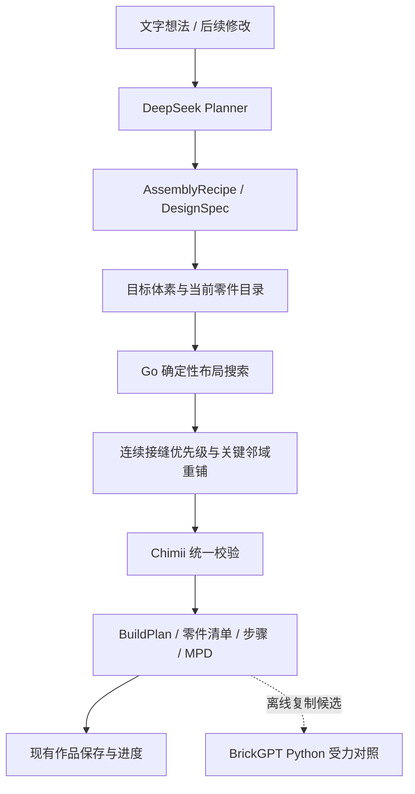

# BrickGPT 与 Chimii 的集成方案及首批实现

日期：2026-09-09。应用基线提交：`3d74637`。本次修改尚未提交或部署。

## 集成结论

保留 DeepSeek 规划、Go 编译、统一校验和现有作品生命周期。把 BrickGPT 中与语言模型无关的结构算法迁入编译器，把 Python 受力模块用于独立对照。运行 Chimii 不需要 Llama、Torch、Blender 或 Gurobi。

首批针对已配置库存的形状求解，接入连续接缝优先级、上下接触组件优先级和关键邻域重铺。不是把 Python 模型换一个 DeepSeek API 地址，也不是把研究仓库整体作为产品后端启动。

## 项目真实调用路径

| 业务环节 | 代码入口 | 当前职责 |
| --- | --- | --- |
| 用户对话和生成任务 | `server/internal/handler/build_conversation.go`、`build_dispatch.go` | 工作区与身份约束、会话和队列 |
| 执行与恢复 | `server/internal/handler/build_worker.go` | 租约、当前可用零件、规划检查点、编译、事务完成 |
| DeepSeek 规划 | `server/internal/handler/build_planner.go` → `LLM.GenerateReasonedText` | 返回目标形状或已审阅模块，不输出任意零件编号与摆放坐标 |
| 目标形状 | `server/internal/build/design.go` | `DesignSpec`：加减体积、孔洞、重复、颜色与形状标识 |
| 零件布局 | `server/internal/build/shape-solver.go`、`shape-repair.go` | 按真实目录铺砖、有限搜索、局部重铺 |
| 模块布局 | `server/internal/build/modules.go`、`compiler.go` | 轮子等特殊机构继续走已审阅模块 |
| 最终验收 | `compiler.go`、`mechanics.go` | 库存、碰撞、精确连接、连通、分步支撑和静态重心检查 |
| 业务交付 | `BuildPlan`、`ExportMPD`、作品及进度接口 | 零件清单、3D 与步骤、MPD、不可变作品、编辑形成新作品 |



生成不会占用、冻结或消耗库存。库存数量限制单个同时拼搭的作品。参数修改仍可直接编译，不增加 DeepSeek 请求；旧作品保持原计划与进度。

## 本地 BrickGPT 内容的取舍

本地 `server/BrickGPT` 没有 Git 元数据。核验了本次使用的 19 个源码及许可文件，与固定上游提交 `da01aab83f646a700e2270b66b4c00180523448b` 对应文件的 SHA-256 一致。此核验不等于证明目录中所有文件均与该提交一致。

| 上游模块 | 已确认的行为 | 接入方式 |
| --- | --- | --- |
| `mesh2brick/voxel2brick.py` | 按跨接接缝和连接组件排序，选取关键邻域，拆分重铺，未改善则恢复 | 已将适用思路改写为有预算的确定性 Go 搜索 |
| `brickgpt/stability_analysis` | 力与力矩求解，采用隐含底板连接条件，依赖 Gurobi | 已有离线桥接，本次支持默认直接读取本地目录；暂不作为产品验收条件 |
| `brickgpt/models/brickgpt.py` | 对本地模型输出逐砖拒绝采样、回退 token 状态并重生成 | 保留作研究参考；现有 DeepSeek 规划器没有本地 token/logit 控制接口，不能直接替换调用 |
| StableText2Brick 数据工具 | 已固定版本的官方测试集及候选导入 | 保留对照评测；不将论文数据当作零件认证或实物验证 |
| `mesh2brick/mesh2brick.py` | 网格体素化并转成积木布局 | 后续图片/网格输入阶段再评估；当前产品输入是可编辑的结构化目标形状 |
| `mesh2brick/planning.py` | 层内排序；达到其库中库存上限时会跳过后续砖块 | 不使用其指令导出器；Chimii 保留完整目标，缺件必须失败 |
| `render_bricks.py`、`texture/`、`demo/` | Blender 渲染、纹理链路、研究演示；部分依赖独立子模块 | 延续项目现有 3D、步骤和 MPD；本次不安装这些依赖 |

`server/BrickGPT` 是可核验的算法参考及离线工具输入。业务编译器运行的是 Go 实现，不在请求处理中读取该目录。上游源码保持原样，其依赖未加入项目默认安装或测试流程。

## 已实现的编译器改进

1. **连续接缝优先级**：借鉴 `_count_gaps`，统计候选下方持续存在的砖缝，优先用下一块砖跨接。坐标改为 Chimii 的薄板单位；空缺不算接缝，不能借此填掉门洞。
2. **上下连接组件优先级**：局部重铺时，除了下方支撑，也考虑与保留下来的上层零件连接。上方接触仅用于排序，不冒充来自先前步骤的支撑。
3. **扩大关键邻域**：两块砖重铺失败后，可包含相邻层在内的最多 8 块砖重新铺设。只接受连接组件减少且没有其他校验错误的结果；失败丢弃临时搜索状态。
4. **成本与版本**：保留原有较轻的首次布局尝试；已配置库存时，后续确定性重启使用新优先级和邻域重铺；未配置库存的自由选砖保留原有六种方向搜索。所有搜索共享 24,000 节点、8 秒期限与 200 块限制。形状生成器版本变为 `shape-layout-v2`，校验器版本不变。
5. **出处与许可**：`server/internal/build/THIRD_PARTY_NOTICES.md` 记录源文件、固定提交和文件哈希，并保留上游 MIT 许可全文。

这次集成没有添加新 API、数据库表或第二套作品格式；Web、Desktop 和 Mobile 的既有请求都经过相同后端编译入口。上线前仍需正常构建、部署和端到端验收。

## 本地评测

### 原有 100 案例

沿用原始案例，不调整目标、目录、库存、校验器或预期。前后语料哈希一致，100 个案例的输出语义哈希全部一致：59 接受、41 拒绝、60 项明确契约全部符合预期。41 个拒绝中包含刻意构造的错误，不能把 59/100 当作生成成功率。

原先 5 个长跨度桥仍返回搜索上限。本次没有通过添加不存在的长砖、改变孔洞、扩大模型范围或降低校验要求来使它们通过。

### 新增 80 个库存与接缝案例

`build-seams-v1` 是固定的合成编译语料：由种子 42 的矩形铺砖采样形成库存组合，冻结所有 80 组尺寸和数量；包括全部失败案例。每个目标都要求精确体积、蓝色和精确块数。这不是 DeepSeek 输出，也不是 StableText2Brick 官方数据。

| 结果 | 原编译器 | 接入后 |
| --- | ---: | ---: |
| 接受 | 68 | 71 |
| 搜索上限 | 11 | 8 |
| 结构拒绝 | 1 | 1 |
| 独立几何、数量、库存等不变量偏差 | 0 | 0 |

所有原来接受的案例仍接受。新增通过的是 `seam-028`、`seam-069`、`seam-072`，已增加完整编译回归测试。80 项均是能力观察，不能宣称全部已有可拼搭的标准答案。

此外，固定的 21 块断开布局验证了局部修复：原两块重铺不能连接整体，扩大邻域后通过现有校验，保持原体积、形状标识、颜色、块数及库存。预算耗尽、取消、缺件、精确块数冲突均有不修改输入的回归测试。

前后对照将基线提交中的 `shape-solver.go`、`shape-repair.go` 和 `design.go` 通过 Go `-overlay` 恢复到临时文件，再运行同一份新评测语料，不切换或修改当前工作区。结果保存在 `output/build-eval/2026-09-09/`。

耗时仅作为本机编译器观察，不含模型、排队、数据库和网络，也不作服务时延承诺。本次目标是提高受限库存下的求解能力，不声明所有案例都更快。

### 本地 Python 受力接入

直接使用 `server/BrickGPT` 实跑 7 个已知的小规模边界案例，逐砖前缀检查得到 5 个通过、2 个因悬空拒绝，报告完整。这是选定的接入冒烟测试，不是有代表性的质量样本。两个彼此分离的落地组件可在上游隐含底板假设下通过，Chimii 仍因整件不连通而拒绝，说明该模块应保持补充对照地位。

已执行：

- `go test -race -p 1 ./internal/build ./internal/buildeval ./cmd/build-eval -count=1` 通过；命令包编译通过。
- 同三个包的 `go vet` 通过。
- Python 11 项契约测试通过。
- 本地源码 19 项哈希核验通过；在不同工作目录调用也能正确解析源码路径。
- CLI 的未知语料、语料与候选冲突、空案例筛选均按预期失败。
- 原基线和新增语料前后的语料哈希、目录、校验器一致；独立比较确认无接受结果退步、无结构不变量偏差。
- `git diff --check` 和 Go 格式检查通过。

验收过程中发现新排序直接用于自由选砖时会影响环形或桥梁的搜索，已将本批策略限定为库存受限搜索，并增加八格桥的显式回归测试；最终检查均通过，没有扩大搜索预算来掩盖该问题。

完整机器可读结果见[集成对照报告](../output/build-eval/2026-09-09/integration-comparison.json)、[原有基线结果](../output/build-eval/2026-09-09/after.json)、[库存接缝结果](../output/build-eval/2026-09-09/seams-after.json)及[本地受力冒烟记录](../output/build-eval/2026-09-09/local-physics.json)。这些运行产物保存在本地，不纳入源码提交。

## 使用方式

```sh
# 只核验本地源码：不加载模型、Blender 或求解器
make build-brickgpt-check

# 原有基线与新增接缝语料
mkdir -p output/build-eval
make build-eval BUILD_EVAL_ARGS='-output ../output/build-eval/baseline.json'
make build-eval BUILD_EVAL_ARGS='-corpus seams -output ../output/build-eval/seams.json'
make build-eval-test

# 在单独安装了 requirements.txt 的 Python 环境中运行受力对照。
# 默认源码目录为 server/BrickGPT；也可显式传入 --upstream。
python scripts/brickgpt-eval/bridge.py compare \
  --input output/build-eval/baseline.json \
  --output output/build-eval/physics.json --prefixes --timeout 15
```

`-corpus seams` 不与 `-candidates` 混用。源码校验默认路径根据脚本位置解析，不依赖当前 shell 目录。日常 Go 编译和测试不要求存在 BrickGPT 源码目录。

## 后续接入顺序

1. **目录与产品尺寸**：评审 1×4、1×6、1×8、2×6 的真实 LDraw 版本、连接器、占位和渲染资产，同时完成目录同步、库存输入及回归；再评估是否扩大 48 薄板、200 块范围。不能只改上游尺寸表就宣称产品支持新砖。
2. **受力分析**：明确真实底板是否进入 BOM、自由落地与底板连接条件如何分别表示，解决求解器规模与部署问题，再做同一结构的对照及实物校准。超时、许可规模限制、不适用都是无结论，不能当作稳定。
3. **受力引导修复**：有足够对照证据后，才用薄弱位置指导当前邻域重铺；结构不变量和最终统一校验继续保留。
4. **图片与网格**：先定义网格尺度、目标体素、可编辑形状和零件目录之间的转换，再评估 `mesh2brick` 的重用。不能把纹理渲染等同于真实可购颜色或定制可制造零件。

Llama 原模型复现是可选研究项，不是上述工作的前置条件。DeepSeek 继续承担项目规划任务。

## 验证边界

本次是本地代码集成与离线算法验证。尚未部署、未调用真实 DeepSeek 进行生成验收、未做浏览器验收或实物拼搭。生成检查通过不建立实物安全结论。
