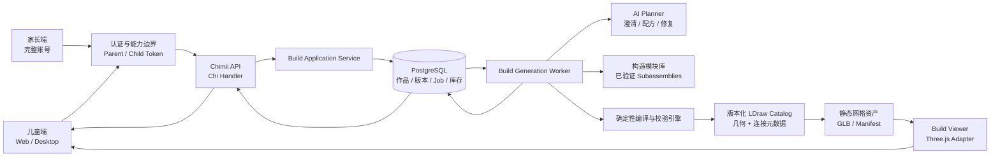
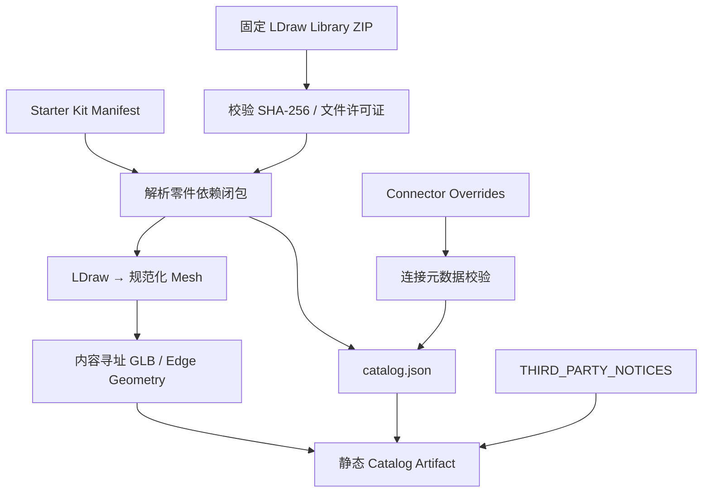
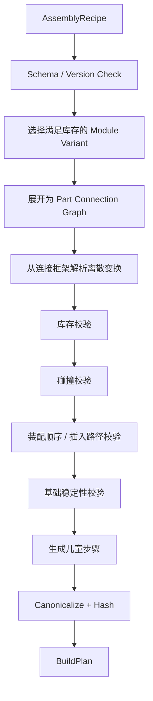
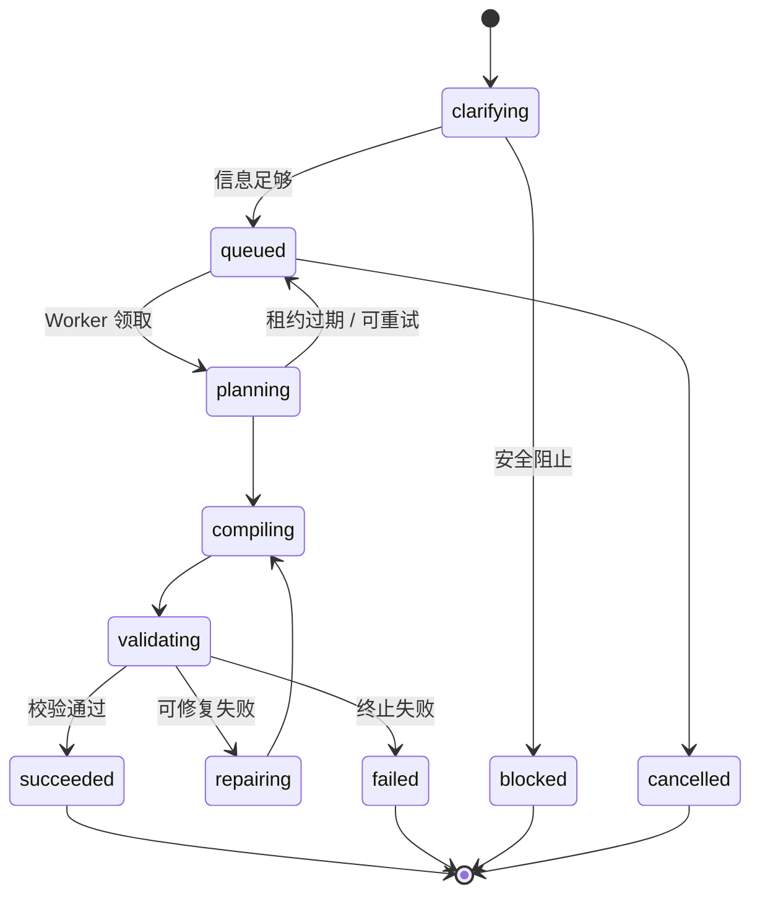

# 技术方案：Build Studio × LDraw 可搭建积木生成架构

> 状态：MVP 纵向切片与官方 LDraw Catalog 已实现 0.3  
> 日期：2026-08-03  
> 关联产品方案：[prd-build-studio.md](./prd-build-studio.md)  
> 本文同时记录架构基线、当前实现边界与后续扩展点

## 0. 当前实施状态

本轮已经打通“一句话 → 必要追问 → LLM 受限意图 → 确定性编译/校验 → BuildPlan
→ 交互预览/步骤 → 自动保存 → MPD 导出”的端到端链路，并实现家长账号、儿童档案、
受限 `mch_` 会话、服务端能力白名单、PostgreSQL 租约队列及 Web/Desktop 路由。

当前 MVP 采用很小的官方 LDraw 零件 ID 白名单与经过测试的四类构造语法。Catalog 编译器
固定官方 `2026-05-29` 快照及其 SHA-256，只解析 10 个 Starter Kit 零件的依赖闭包，生成
内容寻址 GLB；客户端按结果页懒加载约 430 KB 的编译资产，WebGL 不可用、Catalog 版本
不匹配或作品列表缩略图时降级到由同一 `BuildPlan` 绘制的几何投影。`.mpd` 使用真实官方
零件编号和整数 LDU 变换。

当前确定性校验仍使用离散凸点网格、包围占用、连接和基础重心规则，不声称已经完成基于
三角网格的精细碰撞或插入扫掠验证。可配置实体库存、连接器覆盖层、语音输入、作品版本/
改造与实体搭建质量闸门仍留在后续迭代。

## 1. 结论摘要

推荐采用以下总体架构：

1. **LDraw 是零件几何标准和交换格式，不是产品核心数据模型。**
2. **AI 不直接生成世界坐标或自由网格。** AI 输出受约束的模块配方和连接图。
3. **确定性积木编译器**将连接图解析为精确 LDraw 变换，并完成库存、连接、碰撞、
   装配顺序和基础稳定性校验。
4. **`BuildPlan` 是唯一真相来源。** 3D 预览、步骤图、零件清单和 `.mpd` 均由同一
   `BuildPlan` 派生。
5. **第一版使用固定 CHIMII Starter Kit 和经过实体测试的构造模块库。** 不允许 AI 在
   任意 LDraw 零件全集中自由搜索。
6. **生成任务使用 PostgreSQL 持久化队列、租约和幂等键。** API 请求不等待完整生成。
7. **儿童模式使用独立的受限能力令牌。** 不给现有 CLI、Agent 和管理 API 普遍增加 PIN。
8. **3D 在客户端渲染。** LDraw 子集在构建期转换为面向 Web 的缓存网格；服务端负责
   方案真实性和 MPD 导出，不承担 GPU 渲染。
9. **先做“可搭建性技术闸门”，再做完整 UI。** 如果固定基准集达不到通过率，不扩大
   产品开发范围。

一句话概括：

```text
儿童语言 → 安全的设计意图 → 受约束的构造配方 → 确定性积木编译器
        → 可验证 BuildPlan → 3D / 步骤 / 清单 / MPD
```

## 2. 为什么不让 LLM 直接生成 LDraw 文件

LDraw 能准确表达零件引用、颜色和变换，但“格式合法”不等于“真实可搭”：

- LLM 容易产生不存在的零件编号或连接点。
- 直接生成 3×3 浮点矩阵容易出现累计误差、镜像和错误坐标系。
- 两个零件几何上接近，不代表它们能合法连接。
- LDraw 文件本身不携带 CHIMII 所需的家庭库存、年龄难度、安全策略和校验报告。
- 一份视觉上成立的模型，可能存在碰撞、悬空、无法插入或重心不稳。

因此 LDraw 应位于系统边缘：输入零件几何、输出行业通用模型；内部使用更严格、可版本化
和可审计的领域模型。

LDraw 官方格式是文本格式，使用右手坐标系且 `-Y` 为上；1 个标准积木宽度为 20 LDU，
积木高度为 24 LDU，板高度为 8 LDU。方案实现必须在一个适配层内完成坐标转换，不能让
LDraw 坐标约定散落到 UI 和业务代码。官方资料：

- [LDraw File Format 1.0.2](https://www.ldraw.org/article/218.html)
- [LDraw Official Parts Library Specification](https://www.ldraw.org/article/512.html)
- [LDraw MPD Specification](https://www.ldraw.org/article/47.html)
- [LDraw Colour Definition Reference](https://www.ldraw.org/article/547.html)
- [LDraw Legal Information](https://www.ldraw.org/legal-info)

## 3. 架构目标与约束

### 3.1 架构目标

- 任何展示为“可以搭”的方案均可追溯到确定性校验记录。
- 同一输入、相同目录和相同引擎版本得到可重放的编译结果。
- 生成任务在服务重启、请求断开和多实例竞争下不会丢失或重复落库。
- Web 与 Desktop 使用相同数据、查询和 3D 组件。
- 自部署只运行现有 Go 服务也能使用；云部署可以单独扩容生成 Worker。
- LLM、渲染器或 LDraw 库未来可替换，不改变已保存作品的数据语义。
- 儿童凭证无法调用管理 API，也不能跨工作区读取其他家庭数据。

### 3.2 当前仓库约束

- Go + Chi + sqlc + PostgreSQL 是后端主栈。
- React Query 管理服务端状态，Zustand 只管理草稿、相机等客户端状态。
- Web 与 Desktop 业务页面放在 `packages/views`，平台路由分别接线。
- `packages/views` 不直接依赖 Next.js 或 React Router。
- API 响应必须经过 Zod 与 `parseWithFallback`。
- 不使用数据库外键；关联校验和级联删除在应用事务中完成。
- 所有索引使用单独迁移文件中的 `CREATE [UNIQUE] INDEX CONCURRENTLY`。
- 当前服务已有 PostgreSQL `FOR UPDATE SKIP LOCKED` + 租约 Worker 模式，应复用其可靠性
  原则，不引入第二种队列基础设施。

### 3.3 非目标

- 不在 MVP 中实现通用 CAD 或完整物理仿真器。
- 不导入任意用户上传的 LDraw 零件。
- 不在运行时下载最新 LDraw 官方库。
- 不让浏览器决定方案是否可搭建。
- 不为 Build 单独引入 Redis、Kafka、Temporal 或 Kubernetes 微服务体系。
- 不把现有 Issue、Agent Task 或 Chat Session 改造成作品数据模型。

## 4. 总体架构



### 4.1 运行时边界

**API 进程负责：**

- 认证、工作区与儿童档案权限。
- 创建/读取创作会话、作品、版本和库存。
- 事务性创建生成任务。
- 查询状态、保存搭建进度、导出 MPD。
- 发布不含儿童原文的实时事件。

**Build Worker 负责：**

- 领取持久化任务和续租。
- 调用 LLM 完成澄清决策、构造配方和局部修复。
- 调用纯确定性编译、校验和 MPD 编码模块。
- 以带租约令牌的条件更新提交最终结果。

**客户端负责：**

- 文字/语音输入、儿童交互和生成进度显示。
- 从 `BuildPlan` + 静态零件网格渲染 3D。
- 相机、选中零件、展开状态等纯视图状态。
- 可选生成非权威缩略图；缩略图不能参与校验或导出。

### 4.2 部署形态

MVP 使用**模块化单体**：Build Worker 与现有 API 二进制一起启动，复用连接池、日志、
指标和优雅退出逻辑。

Worker 与 API 只通过 PostgreSQL Job 表耦合。生产负载增加后，可在同一代码库中增加
`cmd/build-worker` 启动入口，API 实例关闭嵌入 Worker，Worker 实例独立扩容。此变化不需要
修改 API、表结构或任务语义，因此不是一次微服务重写。

## 5. 核心架构决策

### ADR-001：`BuildPlan` 是真相来源，LDraw 是适配格式

**状态：** 建议采纳

`BuildPlan` 保存产品需要的完整语义：库存快照、儿童难度、零件实例、连接、步骤、版本和
校验报告。LDraw 只负责零件几何标识、颜色映射、变换和 MPD 导出。

结果：

- 不把 `.ldr/.mpd` 原文作为数据库主数据。
- 可按需重新生成 MPD，无需长期保存重复文件。
- 更换渲染器不影响历史方案。
- 可明确区分“模型可解析”和“方案通过 CHIMII 校验”。

### ADR-002：LLM 输出构造配方和连接图，不输出自由坐标

**状态：** 建议采纳

生成过程包含三层表示：

1. `DesignBrief`：从儿童对话得到的安全、结构化设计意图。
2. `AssemblyRecipe`：AI 选择的构造模块、参数、颜色和模块连接关系。
3. `BuildPlan`：引擎展开模块并解析所有零件连接后得到的确定性模型。

世界坐标、矩阵和步骤零件集合由编译器计算。AI 不能写入 `validation.passed`。

### ADR-003：MVP 使用构造语法，不进行无限制逐零件生成

**状态：** 建议采纳

仅靠 LLM 在数十种零件中逐块设计，很难同时达到 60 秒、95% 校验通过率和儿童可搭建。
MVP 引入经过实体测试的构造模块库：

- 稳定底座、轮式底盘
- 小型身体、头部、腿、尾巴、耳朵、翅膀
- 门、箱体、塔楼、装饰面
- 模块之间的标准接口

AI 负责选择和组合模块，并在安全范围内调整尺寸、颜色和装饰。编译器将模块展开为
具体零件。后续版本可以引入受限的逐零件局部变异，但必须走同一校验器。

### ADR-004：PostgreSQL 是生成队列的可靠性边界

**状态：** 建议采纳

复用仓库已有模式：`FOR UPDATE SKIP LOCKED`、过期租约、租约令牌、幂等键和有界退避。
进程内 channel 只用于降低领取延迟，不是任务真相来源。

### ADR-005：儿童模式使用受限令牌，不修改现有完整账号权限语义

**状态：** 建议采纳

新增高熵不透明令牌前缀 `mch_`。认证中间件验证令牌哈希后，服务端覆盖：

- `X-User-ID`
- `X-Workspace-ID`
- `X-Child-Profile-ID`
- `X-Actor-Source: child_session`

儿童令牌只允许 Build、作品、当前档案和家长解锁接口。完整 JWT/PAT、CLI、Agent Task
Token 和集成保持现有行为。

### ADR-006：运行时使用预编译网格，不让客户端加载完整 LDraw 零件库

**状态：** 建议采纳

目录构建工具只提取 Starter Kit 的依赖闭包，将 LDraw 几何转换为按内容寻址的静态网格。
客户端通过渲染适配器加载这些网格。Three.js 官方提供 LDrawLoader 示例，可作为目录编译
工具的解析基础，但运行时业务代码不直接依赖其格式细节：

- [Three.js LDrawLoader example](https://threejs.org/examples/webgl_loader_ldraw.html)

## 6. LDraw 目录系统

### 6.1 输入

- 固定版本的 LDraw Official Parts Library 压缩包。
- 对应 `LDConfig.ldr` 颜色表。
- `chimii-starter-v1.json`：允许的零件、颜色和默认数量。
- `connectors/*.yaml`：CHIMII 维护的连接点元数据。
- `modules/*.yaml`：经过校验和实体测试的构造模块。

任何外部版本必须在构建时固定：下载 URL、发布日期、SHA-256 和每个文件头中的许可证。
运行时不执行“自动更新到最新零件库”。

### 6.2 连接元数据

LDraw 几何不足以表达产品需要的所有连接语义，因此每个可用零件维护连接点覆盖层：

```text
Connector
  id
  kind                 # stud, anti_stud, axle, axle_hole, pin...
  local_position_ldu   # 整数 LDU
  local_orientation    # 离散 OrientationId
  insertion_axis
  occupancy            # single / multi
  strength_class
  collision_allowance
```

MVP Starter Kit 应优先使用普通砖、板、坡面和简单轮轴，排除柔性件、绳、贴纸、复杂铰链、
气动和需要连续角度求解的零件。

### 6.3 坐标与数值模型

- Catalog 内部保留 LDraw 原始 `-Y up` 坐标，单位为整数 LDU。
- `BuildPlan` 平移使用整数 LDU。
- MVP 旋转只允许一个离散 `OrientationId` 集合，不持久化任意浮点欧拉角。
- 渲染适配器在根节点一次性转换到 Three.js 坐标。
- MPD 编码器最后将 `OrientationId` 转为 LDraw 3×3 变换矩阵。

这样可以避免浮点漂移、负零、矩阵不正交和镜像零件。

### 6.4 Catalog 构建流水线



已新增独立构建工具 `tools/ldraw-catalog/`：

- 使用标准库 ZIP 读取器与受限 LDraw 解析器处理 type 1/3/4、继承颜色和嵌套变换。
- 同时生成渲染网格、简化碰撞体、零件包围盒和依赖 manifest。
- 生成物按 hash 命名，支持永久缓存。
- CI 验证生成物与 manifest 一致，不允许手工编辑生成文件。
- 当前 10 个 GLB 以生成 TypeScript 资产嵌入懒加载 chunk，Web 与 Desktop 共用且支持离线；
  零件集扩大后可无接口变化地迁移到统一 Catalog Base URL。

### 6.5 许可证处理

- 逐文件读取 `!LICENSE`，不要假设所有历史零件只有一个许可证版本。
- 根据固定输入自动生成 `THIRD_PARTY_NOTICES` 和 catalog manifest 的归属字段。
- 导出的 MPD 只引用官方零件文件名，不内嵌官方 `.dat` 源文件。
- 下载页和产品“关于”页面展示 LDraw Parts Library 归属与许可证链接。
- 未经审核的 unofficial parts 不进入 MVP catalog。

## 7. 领域模型

### 7.1 `DesignBrief`

`DesignBrief` 是儿童原始语言的最小化、适龄结构化结果：

```text
DesignBrief
  schema_version
  archetype            # creature / vehicle / building / character / object
  theme                # 原创主题，不保存商业 IP 复刻指令
  desired_features[]   # tail, wheels, opening_door...
  size_class           # palm / book
  personality
  preferred_colors[]
  age_band
  difficulty_target
  safety_constraints[]
```

服务端不长期保存原始音频。追问优先保存问题 ID 与选项 ID，而不是完整自然语言聊天记录。
自由文本回答经安全检查和结构化后，只保存 `DesignBrief` 的结果。

### 7.2 `AssemblyRecipe`

AI 输出严格 JSON Schema：

```text
AssemblyRecipe
  schema_version
  catalog_version
  module_library_version
  root_module_id
  modules[]
    instance_id
    module_id
    variant_parameters
    preferred_colors[]
  mates[]
    parent_module_instance_id
    parent_interface_id
    child_module_instance_id
    child_interface_id
  semantic_steps[]
  title_candidates[]
```

`module_id`、接口 ID 和枚举都必须来自当前模块库。AI 不输出零件世界坐标。

### 7.3 `BuildPlan`

```text
BuildPlan
  schema_version
  plan_id
  catalog_version
  module_library_version
  compiler_version
  validator_version
  inventory_snapshot_hash
  title
  age_band
  difficulty
  estimated_minutes
  bounds_ldu
  parts[]
    part_key
    ldraw_part_id
    ldraw_color_code
    required_quantity
  instances[]
    instance_id
    part_key
    ldraw_part_id
    ldraw_color_code
    position_ldu
    orientation_id
    source_module_instance_id
  connections[]
    connection_id
    a_instance_id
    a_connector_id
    b_instance_id
    b_connector_id
    strength_class
  steps[]
    step_number
    added_instance_ids[]
    focus_connection_ids[]
    camera_preset
    child_instruction_key
    child_instruction_args
  validation
    passed
    checks[]
    tested_at
  content_hash
```

儿童指引优先使用本地化模板 `key + args`，避免把未审查的 LLM 长文本直接展示给儿童。
只有无法模板化的鼓励语才使用经过输出安全检查的短文本。

### 7.4 内容寻址与版本化

`content_hash` 对规范化后的以下内容计算 SHA-256：

- Catalog、模块库、编译器和校验器版本
- 库存快照
- 零件实例、连接和步骤

不把标题、生成时间和数据库 ID 放入 hash。相同物理模型可以稳定去重、缓存和重放。

## 8. 构造模块与编译器

### 8.1 模块定义

每个模块是一个已通过引擎校验、并完成至少一次实体搭建测试的参数化子装配：

```text
ConstructionModule
  module_id
  version
  supported_age_bands[]
  difficulty_cost
  parameters_schema
  variants[]
    inventory_cost
    instances[]
    internal_connections[]
    interfaces[]
    build_steps[]
  physical_test_status
```

模块接口使用与零件连接点相同的坐标和兼容规则。编译器只允许兼容接口配对。

### 8.2 编译阶段



### 8.3 变换求解

1. 选择根模块和根零件，放在整数 LDU 原点。
2. 按模块连接图做确定性遍历。
3. 根据父接口框架、子接口框架和兼容规则计算子模块刚体变换。
4. 所有结果量化为整数 LDU + `OrientationId`。
5. 同一实例通过多条路径得到不一致变换时，返回 `CONSTRAINT_CONFLICT`。

### 8.4 校验器

校验器分为硬失败和警告：

**硬失败：**

- 未知零件、颜色、模块或 schema 版本。
- 数量超过库存快照。
- 非法、重复占用或不兼容连接。
- 非允许范围内的几何碰撞。
- 模型存在未连接组件。
- 当前搭建步骤无法沿连接插入轴完成装配。
- 使用被安全策略禁止的零件或结构。

**基础稳定性失败：**

- 模型没有有效落地面。
- 各步骤累计重心投影超出支持多边形安全边距。
- 超过模块定义的悬臂、细高比或弱连接阈值。

**警告：**

- 颜色替代影响外观但不影响结构。
- 搭建时间或零件数量接近年龄段上限。
- 结构通过算法检查，但包含尚未进行家庭实测的新模块组合。

只有零硬失败，并且所有使用模块均达到 MVP 所需实体测试级别，才能设置
`validation.passed=true`。

### 8.5 碰撞策略

- Broad phase：按零件包围盒构建空间索引。
- Narrow phase：使用预计算的简化碰撞体，而不是高精度渲染三角网格。
- 连接点规则声明允许的正常嵌入区域，例如 stud 与 anti-stud 的合法重叠。
- 输出必须包含两个实例 ID、碰撞区域和错误码，供修复模型局部处理。

### 8.6 装配顺序

仅“最终几何不碰撞”仍可能无法实际装入。每个连接点记录插入轴和所需间隙，步骤校验器
模拟零件沿插入轴进入最终位置的扫掠体。MVP 不支持需要弯曲、压缩或复杂多轴同时装配的
步骤。

## 9. AI 编排

### 9.1 模型职责拆分

使用现有 `server/pkg/llm` OpenAI-compatible 内部客户端，新增 Build 专用的严格结构化调用
封装，而不是让 handler 拼提示词。

| 调用 | 输入 | 输出 | 目标时限 |
| --- | --- | --- | --- |
| Clarifier | 当前 `DesignBrief` + 可问字段 | 下一个问题或 ready | P95 1.5s |
| Planner | `DesignBrief` + 紧凑模块目录 + 库存摘要 | `AssemblyRecipe` | P95 15s |
| Repair | 错误码 + 局部图 + 可用替代模块 | JSON Patch 风格修改 | P95 8s |
| Naming | 已通过方案语义 | 2–3 个适龄名称 | 可与渲染并行 |

### 9.2 结构化输出

- 使用模型支持的 JSON Schema / response format。
- 服务端始终再次执行 Go schema 校验；上游“结构化输出成功”不是信任边界。
- temperature 和 token 上限由服务端固定，不由客户端传入。
- Prompt、schema、模型 ID 和推理参数记录版本。
- 不把完整 LDraw 网格放入上下文，只给模型模块目录、接口和库存摘要。
- Clarifier、Planner 和 Repair 使用各自的 context deadline，不能依赖通用客户端的 60 秒
  默认超时。
- Build 启用时执行一次结构化输出能力探测；不支持所需 JSON Schema 的兼容网关应让
  `/api/config` 返回 Build unavailable，不能静默退化为自由文本解析。

### 9.3 修复循环

```text
Planner → Compile/Validate
  ├─ pass → 保存
  └─ fail → 生成局部错误摘要
            → Repair 1 → Compile/Validate
              ├─ pass → 保存
              └─ fail → Repair 2 → Compile/Validate
                         ├─ pass → 保存
                         └─ fail → 安全降级方案或终止
```

修复模型只能使用受控操作：替换模块变体、删除非核心装饰、缩小尺寸、改变颜色或改用兼容
接口。不能直接修改世界坐标或强制忽略校验错误。

### 9.4 降级策略

两次修复仍失败时：

1. 尝试由引擎选择同主题的最小安全配方。
2. 如果库存仍不满足，返回 `INVENTORY_UNSATISFIABLE`，明确缺少哪类基础零件。
3. 不把失败结果保存为可搭建作品。
4. 保留结构化 `DesignBrief`，允许儿童点击“做得简单一点”重试。

## 10. 持久化任务与状态机

### 10.1 状态机



数据库存储稳定粗粒度状态；面向儿童的进度文案使用单独 `stage` 映射，不让 UI 依赖内部
Worker 细节。

### 10.2 领取和租约

- Worker 使用 `FOR UPDATE SKIP LOCKED LIMIT 1` 领取 `queued` 且到期的任务。
- 领取写入随机 `lease_token` 和 `lease_expires_at`。
- LLM 调用期间定时续租；续租失败后取消当前上下文并丢弃结果。
- 所有阶段更新、重试和成功提交都带 `WHERE lease_token = $token`。
- 慢 Worker 超出租约后不能覆盖新 Worker 的结果。
- `notify chan struct{}` 只用于本进程快速唤醒；轮询负责崩溃恢复。

### 10.3 幂等性

- 客户端创建会话和提交答案都携带 UUID `client_request_id`。
- 数据库唯一索引 `(workspace_id, client_request_id)` 防止双击和网络重试重复生成。
- 一个 `build_revision` 最多存在一个有效 generation job。
- 最终版本以 `content_hash` 去重；重复结果返回已有版本。
- MPD 由 `BuildPlan` 按需生成，天然幂等。

### 10.4 重试分类

**可重试：** LLM 5xx/限流、临时网络错误、数据库连接中断、Worker 崩溃。

**不可重试：** schema 不支持、库存无解、安全阻止、目录版本不存在、两次修复后仍不合法。

Worker 级网络重试与模型级结构修复分别计数，不能混用一个 `attempts` 字段。

## 11. 数据模型

### 11.1 表结构建议

#### `family_guard`

- `id UUID`
- `workspace_id UUID`
- `pin_hash TEXT`
- `pin_hash_version TEXT`
- `failed_attempts INTEGER`
- `locked_until TIMESTAMPTZ`
- `created_by UUID`
- `created_at / updated_at`

4 位 PIN 只用于防止儿童误入，不是对抗数据库泄漏的高强度账号密码。使用 Argon2id、随机
salt、常数时间比较、递增限速和服务端审计；账号登录仍是最终安全边界。

#### `child_profile`

- `id UUID`
- `workspace_id UUID`
- `display_name TEXT`
- `age_band TEXT CHECK ('6_8', '9_12')`
- `status TEXT CHECK ('active', 'archived')`
- `preferences JSONB`
- `created_by UUID`
- `created_at / updated_at`

#### `child_auth_session`

- `id UUID`
- `token_hash BYTEA`
- `user_id UUID`
- `workspace_id UUID`
- `child_profile_id UUID`
- `expires_at / revoked_at / last_used_at`
- `created_at`

只保存 `mch_` 高熵令牌哈希，不保存原始令牌。

#### `brick_inventory`

- `id UUID`
- `workspace_id UUID`
- `child_profile_id UUID`
- `catalog_version TEXT`
- `kit_id TEXT`
- `revision INTEGER`
- `created_at / updated_at`

#### `brick_inventory_item`

- `inventory_id UUID`
- `part_key TEXT`
- `ldraw_color_code INTEGER`
- `quantity INTEGER CHECK (quantity >= 0)`

#### `build_session`

- `id UUID`
- `workspace_id UUID`
- `child_profile_id UUID`
- `created_by_user_id UUID`
- `status TEXT`
- `design_brief JSONB`
- `question_count INTEGER`
- `next_question JSONB`
- `client_request_id UUID`
- `expires_at`
- `created_at / updated_at`

不保存原始音频；默认不保存完整逐字对话。

#### `build_creation`

- `id UUID`
- `workspace_id UUID`
- `child_profile_id UUID`
- `title TEXT`
- `status TEXT CHECK ('ready', 'building', 'completed', 'archived')`
- `current_revision_id UUID`
- `current_step INTEGER`
- `created_by_user_id UUID`
- `created_at / updated_at / completed_at`

#### `build_revision`

- `id UUID`
- `workspace_id UUID`（冗余租户守卫）
- `creation_id UUID`
- `revision_number INTEGER`
- `parent_revision_id UUID`
- `design_brief JSONB`
- `inventory_snapshot JSONB`
- `recipe JSONB`
- `plan JSONB`
- `content_hash TEXT`
- `catalog_version / module_library_version / compiler_version / validator_version`
- `validation_status TEXT`
- `created_at`

版本不可原地修改。

#### `build_generation_job`

- `id UUID`
- `workspace_id UUID`
- `child_profile_id UUID`
- `build_session_id UUID`
- `creation_id UUID NULL`
- `target_revision_number INTEGER`
- `status / stage`
- `available_at`
- `lease_token UUID / lease_expires_at`
- `worker_attempts / repair_attempts`
- `client_request_id UUID`
- `error_code / error_detail JSONB`
- `created_at / started_at / finished_at / updated_at`

### 11.2 索引

至少需要以下并发索引，每个单独迁移：

- `family_guard(workspace_id)` unique
- `child_profile(workspace_id) WHERE status = 'active'` unique（MVP 单档案）
- `child_auth_session(token_hash)` unique
- `brick_inventory_item(inventory_id, part_key, ldraw_color_code)` unique
- `build_creation(workspace_id, child_profile_id, updated_at DESC)`
- `build_revision(creation_id, revision_number)` unique
- `build_revision(content_hash)`
- `build_generation_job(workspace_id, client_request_id)` unique
- `build_generation_job(status, available_at)` partial for queued jobs

不添加外键。创建版本、切换 current revision、删除作品及清理 Job 必须由应用层事务显式保证。

### 11.3 删除与保留

- 删除儿童档案需要事务性归档或删除其 session、inventory、creation、revision 和 auth session。
- 删除作品先删除数据库引用，再删除可选缩略图对象；对象删除失败进入现有风格的回收账本。
- 过期 `build_session` 和终态 Job 由内部 scheduler 定期清理。
- 已保存作品保留结构化 `DesignBrief`，不保留原始音频和默认逐字对话。

## 12. API 设计

### 12.1 家长配置 API

```text
PUT    /api/family/guard
POST   /api/child-sessions
POST   /api/child-sessions/current/unlock
POST   /api/child-sessions/current/resume
DELETE /api/child-sessions/current
GET    /api/child-profile
PUT    /api/child-profile
GET    /api/brick-inventory
PUT    /api/brick-inventory
```

- 创建儿童 session 需要完整人类 JWT/PAT 和工作区管理权限。
- `unlock` 允许 `mch_` token + PIN，成功后签发短期完整人类 JWT。
- Parent 模式超时后通过保留的 child session 恢复受限凭证。

### 12.2 儿童创作 API

```text
POST   /api/build/sessions
GET    /api/build/sessions/{id}
POST   /api/build/sessions/{id}/answers
POST   /api/build/sessions/{id}/generate
POST   /api/build/sessions/{id}/cancel

GET    /api/creations
GET    /api/creations/{id}
POST   /api/creations/{id}/revisions
PUT    /api/creations/{id}/progress
POST   /api/creations/{id}/archive
POST   /api/creations/{id}/complete
GET    /api/creations/{id}/revisions/{revisionId}/export.mpd
DELETE /api/creations/{id}    # parent only
```

### 12.3 响应原则

- 创建异步任务返回 `202 Accepted`、session/job ID、状态和下次查询建议。
- 每个响应包含稳定枚举；前端 enum switch 有默认分支。
- 错误使用稳定 code、`retryable` 和结构化 details，不把上游 LLM 错误原文发给儿童。
- 每个 ID 读取都同时过滤 `workspace_id`；儿童令牌还必须过滤 `child_profile_id`。
- API JSON 全部定义 Zod schema，并包含畸形响应 fallback 测试。

### 12.4 错误码

```text
PARENT_UNLOCK_REQUIRED
CHILD_SESSION_EXPIRED
BUILD_INPUT_UNSAFE
BUILD_INVENTORY_UNCONFIGURED
BUILD_INVENTORY_UNSATISFIABLE
BUILD_CATALOG_UNAVAILABLE
BUILD_PLAN_INVALID
BUILD_GENERATION_TIMEOUT
BUILD_JOB_RETRYING
BUILD_JOB_CANCELLED
BUILD_REVISION_CONFLICT
```

儿童界面通过 i18n key 映射适龄文案；错误码本身不直接展示。

## 13. 儿童与家长认证流程

### 13.1 进入儿童模式

1. 家长用现有完整 JWT 登录。
2. 调用 `POST /api/child-sessions`，服务端创建高熵 `mch_` token 并只存 hash。
3. Web 用 `mch_` 替换 `chimii_auth` cookie，并重新生成 CSRF cookie；Desktop 将受限 token
   交给 renderer，完整凭证不继续暴露给儿童 UI。
4. React Query 清空管理数据缓存，进入 Build shell。
5. 后续请求由 Auth 中间件设置 `child_session` actor source 和固定工作区/档案。

### 13.2 家长解锁

1. 儿童 token 调用 unlock，提交 PIN。
2. 服务端执行 Argon2id 验证和数据库/IP 双层限速。
3. 成功后签发 15 分钟 parent-mode JWT，claim 绑定 child session 与 workspace。Web 同时将
   原 `mch_` token 保存到名为 `chimii_child_resume` 的 HttpOnly、SameSite=Strict cookie，
   且其 Path 只覆盖 resume/lock 接口；它不能被普通 API 当作完整凭证。
4. UI 清除儿童 shell 状态并显示管理导航。
5. 超时或主动锁定后，专用 resume middleware 只读取 `chimii_child_resume`，重新设置
   `chimii_auth=mch_...` 和配套 CSRF cookie，并清除 parent-mode JWT；不要求重新输入账号
   密码。普通 Auth middleware 不读取 resume cookie。

Desktop 由 main process 的凭证存储保存 child token，renderer 在任意时刻只获得当前模式的
token；切换到 parent mode 时也只获得 15 分钟 JWT。不能把原始长期完整 JWT继续保留在
renderer localStorage。

### 13.3 API 能力规则

```text
完整人类 JWT/PAT  → 现有 API + Build API
Agent Task Token   → 维持现有权限，不自动获得儿童档案管理
Child Token mch_   → Build/Creations/Profile-read/Unlock only
Parent-mode JWT    → 绑定工作区的短期完整人类权限
```

Child token 分支必须像现有 task token 一样覆盖客户端伪造的 actor headers。任何来自客户端的
`X-Actor-Source` 和 `X-Child-Profile-ID` 都先删除，再由认证层写入。

## 14. 前端架构

### 14.1 包结构

```text
packages/core/build/
  types.ts
  schemas.ts
  queries.ts
  mutations.ts
  query-keys.ts
  ws-updaters.ts
  stores/
    idea-draft-store.ts
    viewer-state-store.ts

packages/views/build/
  build-page.tsx
  creation-page.tsx
  creations-page.tsx
  components/
    idea-composer.tsx
    clarification-card.tsx
    generation-progress.tsx
    build-viewer.tsx
    build-step-player.tsx
    parts-list.tsx

packages/views/family/
  child-shell.tsx
  parent-unlock-dialog.tsx
  brick-inventory-settings.tsx

apps/web/app/[workspaceSlug]/(dashboard)/build/page.tsx
apps/web/app/[workspaceSlug]/(dashboard)/creations/page.tsx
apps/web/app/[workspaceSlug]/(dashboard)/creations/[id]/page.tsx
```

Desktop 在现有路由表中接线，不复制业务组件。

### 14.2 状态所有权

**React Query：** session、question、job status、creation、revision、inventory、current step。

**Zustand：** 未提交想法草稿、3D 相机、选中零件、面板展开状态、当前设备朗读偏好。

生成和保存不做静默乐观更新。请求成功后进入服务端返回的 session/job，WebSocket 只负责
使 Query 失效或补丁；断线后 GET 状态恢复。

### 14.3 Query Keys

```text
['build', wsId, profileId, 'session', sessionId]
['build', wsId, profileId, 'creations']
['build', wsId, profileId, 'creation', creationId]
['build', wsId, profileId, 'inventory']
```

所有工作区数据 key 必须包含 `wsId`，儿童数据同时包含 `profileId`。

### 14.4 实时事件

```text
build:session_updated
build:generation_updated
build:creation_created
build:creation_updated
build:creation_deleted
```

事件负载只包含 ID、状态、stage、progress 和版本号，不包含儿童原始输入、DesignBrief 或
完整 BuildPlan。客户端收到事件后更新小状态或失效对应 Query。

事件总线不是持久化来源；重连必须以 API 查询为准。

## 15. 3D 渲染与 MPD 导出

### 15.1 Viewer

`BuildViewer` 依赖一个 `BuildRenderAdapter`，第一版实现使用 Three.js：

```text
BuildRenderAdapter
  loadCatalog(version)
  mountPlan(plan)
  setStep(stepNumber)
  focusConnections(ids)
  resetCamera()
  captureThumbnail()
  dispose()
```

业务组件不直接创建 Three.js Scene、Loader 或 Material。

### 15.2 性能策略

- Catalog manifest 和网格使用内容 hash + immutable cache header。
- 只下载当前作品实际使用的零件网格。
- 相同 `part_key + color` 使用 instancing，减少 draw calls。
- 先显示静态占位和包围盒，再渐进加载边线与高质量材质。
- 当前步骤以 shader/material 状态高亮，不复制整个场景。
- 页面隐藏时暂停 animation loop；组件卸载时释放 geometry/material。
- 低性能设备关闭实时阴影、抗锯齿和高分辨率缩略图。

### 15.3 步骤呈现

- `BuildPlan.steps` 决定每一步新增实例和关注连接。
- 2D 步骤缩略图由客户端按固定 camera preset 渲染并缓存。
- 缩略图是可丢弃缓存；缺失时用 3D 场景即时呈现。
- 朗读文本来自本地化模板，不把模型原始输出直接送入 TTS。

### 15.4 MPD 导出

服务端 MPD 编码器执行：

1. 校验 revision 已通过且版本受支持。
2. 从 `BuildPlan` 转换颜色、LDU 平移与 3×3 方向矩阵。
3. 按步骤写入 `0 STEP`。
4. 对模块或大型子装配可使用 `0 FILE` 组成 MPD。
5. 只引用官方零件名，不嵌入官方 `.dat`。
6. 写入 CHIMII 生成版本、LDraw 归属和作品许可证说明。

LDraw 官方格式明确支持 STEP META；MPD 可将多个子模型放进单个文件。

## 16. 安全、隐私与内容治理

### 16.1 数据最小化

- 原始音频转写后立即删除。
- 默认不保存逐字对话，只保存结构化 `DesignBrief`、问题 ID 和选择 ID。
- 请求日志不记录 body、Prompt、DesignBrief 或 BuildPlan。
- 分析系统只接收年龄段、kit、耗时、错误分类和内部 ID。
- LLM 供应商请求使用专门的儿童数据策略和最短可用保留设置。

### 16.2 输入与输出治理

- 输入安全检查发生在 Clarifier 和 Planner 之前。
- `DesignBrief` 生成后再次执行结构化策略检查。
- 模块库从根源排除火焰、市电、尖锐件、弹射和危险机械能力。
- 生成后的语义描述和儿童指引执行输出检查。
- “危险”不能仅靠关键词；最终结构能力也由模块和零件 allowlist 限制。

### 16.3 租户隔离

- 所有 SQL 查询包含 `workspace_id`。
- Child token 的 workspace/profile 由认证层覆盖，忽略客户端传值。
- revision 查询同时校验 creation、workspace 和 profile。
- 导出和缩略图下载使用相同成员/儿童会话权限，不公开对象 URL。

## 17. 可观测性

### 17.1 指标

```text
chimii_build_jobs_total{result,stage,error_code}
chimii_build_job_duration_seconds{stage}
chimii_build_llm_requests_total{purpose,result,model}
chimii_build_llm_duration_seconds{purpose}
chimii_build_validation_failures_total{check_code}
chimii_build_repair_attempts_total{result}
chimii_build_plan_parts{age_band,archetype}
chimii_build_catalog_asset_bytes{version}
chimii_build_child_auth_denied_total{route}
```

不得把 prompt、作品名、模型内容或 child profile 名写入 label。

### 17.2 结构化日志

允许字段：request ID、job ID、workspace ID、stage、版本、模型 ID、耗时、错误码。

禁止字段：儿童原文、音频、DesignBrief、recipe/plan JSON、PIN、token、LLM 完整响应。

### 17.3 Trace

一个 generation job 使用统一 trace ID，span 覆盖：queue wait、planner、compile、validate、
repair、persist 和 realtime publish。外部 LLM request ID 可记录，但不能记录请求正文。

## 18. 性能和容量

### 18.1 60 秒预算

| 阶段 | P95 预算 |
| --- | ---: |
| 每次追问决策 | 1.5s |
| Planner | 15s |
| 模块解析与编译 | 1s |
| 碰撞、装配与稳定性校验 | 2s |
| 每次 Repair | 8s |
| 数据库提交与事件 | 0.5s |
| 客户端首个可见 3D | 2.5s |

最坏两次修复可能接近 40 秒。其余时间留给网络抖动和排队，目标仍是 P95 生成阶段小于
60 秒。追问属于端到端首创指标，应通过最多 3 问和“你帮我选”控制。

### 18.2 资源限制

- MVP 最大 120 个零件、最大 20 个模块、最大 60 个步骤。
- Planner/Repair JSON 有严格字节与 token 上限。
- 每个家庭同时最多一个 active generation job，后续请求排队或替换。
- Worker 并发默认 4 且有固定上界；后续开放配置时仍必须限制最大值。
- Catalog 和 module library 在 Worker 内存中只读共享。

## 19. 测试策略

### 19.1 Catalog

- LDraw parser/adapter golden tests。
- 固定 ZIP SHA、依赖闭包和许可证 manifest 测试。
- 每个 Starter Kit 零件都有 mesh、颜色和 connector 覆盖。
- Catalog 生成结果可重复：相同输入 hash 完全一致。

### 19.2 编译与校验

- 连接兼容矩阵单元测试。
- 离散变换和 MPD 矩阵 golden tests。
- 库存超量、连接占用、碰撞、悬空和重心边界测试。
- 随机组合 property tests：编译器不能 panic，失败必须返回稳定错误码。
- 相同 recipe 多次编译得到相同 content hash。
- MPD 导出后重新解析，实例/颜色/步骤数量一致。

### 19.3 AI 契约

- 使用 fake LLM 返回合法、缺字段、未知模块、超时和恶意 JSON。
- Prompt snapshot 只在受控测试夹具中保存，不包含真实儿童数据。
- Repair 只能执行 allowlist 操作。
- 基准 DesignBrief 在固定模型快照下统计通过率，但不把非确定 LLM 测试放进普通 CI。

### 19.4 Worker 可靠性

- 多 Worker `SKIP LOCKED` 不重复领取。
- Worker 在 LLM 调用中崩溃后租约到期可恢复。
- 旧 lease token 不能覆盖新 Worker 成功结果。
- 相同 client request ID 只创建一个任务。
- 取消、超时、退避和 graceful shutdown 测试。

### 19.5 权限

- `mch_` token 只能访问 allowlist 路由。
- 客户端伪造 workspace/profile/actor header 被覆盖。
- Child token 不能读取 Issues、Agents、Billing、Settings。
- PIN 限速、锁定、重置和 parent-mode 超时测试。
- 跨工作区和跨 profile ID 读取始终返回统一 404。

### 19.6 前端

- Build/Creations 共享视图组件测试。
- React Query key 隔离和 WebSocket invalidation 测试。
- 生成刷新恢复、离线、失败和 catalog 版本不兼容测试。
- Web 与 Desktop 浏览器视觉验证。
- 3D dispose、重复挂载和低性能模式测试。

### 19.7 实体搭建质量闸门

自动校验不能代替实体测试。发布前至少完成：

- 50 个基准创意自动生成测试。
- 覆盖 4 个 archetype 和两个年龄段。
- 每个构造模块至少一次实体搭建认证。
- 随机抽取至少 20 个完整生成方案由成人和目标年龄儿童分别搭建。
- 记录缺件、误解步骤、无法插入、结构倒塌和完成时间。

## 20. 配置与功能开关

建议配置：

```text
CHIMII_BUILD_ENABLED
CHIMII_BUILD_MODEL
CHIMII_BUILD_CATALOG_DIR
CHIMII_BUILD_WORKER_CONCURRENCY
CHIMII_BUILD_MAX_ACTIVE_PER_WORKSPACE
CHIMII_BUILD_PARENT_MODE_TTL
```

- Build 使用现有 `CHIMII_LLM_*` 连接层，`CHIMII_BUILD_MODEL` 只覆盖模型 ID。
- 未配置 LLM 时 `/api/config` 返回 Build unavailable，前端不展示假入口；当前 Catalog 随
  客户端版本固定发布，版本不匹配时查看器自动降级，未来外置 Catalog 后再加入可用性探测。
- Feature flag 支持按用户/工作区灰度，不改变路由 schema。

## 21. 建议代码布局

```text
server/internal/build/
  domain/          # DesignBrief, Recipe, BuildPlan, errors
  catalog/         # runtime read-only catalog
  grammar/         # construction modules
  compiler/        # graph expansion + transforms
  validator/       # inventory, collision, assembly, stability
  planner/         # LLM prompts + structured output
  export/          # MPD encoder
  service/         # use cases and transactions
  worker/          # durable job processor

server/internal/handler/build.go
server/pkg/db/queries/build.sql
server/pkg/protocol/build.go
tools/ldraw-catalog/
packages/core/build/
packages/views/build/
packages/views/family/
```

依赖方向：

```text
handler → build/service → domain
worker  → planner + compiler + validator + repository
compiler/validator → domain + catalog + grammar
planner → domain + llm interface
export → domain
```

`domain`、`compiler` 和 `validator` 不依赖 HTTP、数据库、Three.js 或 OpenAI SDK。

## 22. 实施顺序

### Phase 0：技术闸门

1. 固定 Starter Kit 与 LDraw 版本。
2. 完成 Catalog 子集构建和许可证 manifest。
3. 定义 connector、module、recipe 和 BuildPlan schema。
4. 完成 3–5 个构造模块、编译器和最小校验器。
5. 手工构造 10 个 recipe，验证 MPD 导出和实体搭建。
6. 接入 Planner，用 50 个基准创意评估通过率和生成耗时。

**Go/No-Go：** 自动生成/两次修复通过率 ≥95%，抽样实体可搭成功率达到产品阈值。

### Phase 1：平台基础

1. 数据表、sqlc 查询和并发索引迁移。
2. Child token、family guard 与认证能力中间件。
3. PostgreSQL Worker、租约、幂等和实时事件。
4. Build/Creations API schema。

### Phase 2：完整创作闭环

1. Build 默认路由与儿童 shell。
2. 输入、追问、生成进度和自动保存。
3. 客户端 Catalog 资产与 3D Viewer。
4. 作品库、步骤播放和进度恢复。

### Phase 3：困难帮助与质量

1. Repair API 与版本历史。
2. 找不到零件、装不上和不稳定的恢复流程。
3. 性能、隐私、安全红队和实体家庭测试。
4. Web/Desktop 灰度发布。

## 23. 主要权衡

### 23.1 构造模块会不会限制创造力？

会，但这是有意的 MVP 权衡。无限制逐零件生成提供理论自由度，却很难兑现 60 秒和真实
可搭建。模块库通过颜色、比例、组合、装饰和语义可以形成大量变化。产品验证成功后，再
开放“局部自由生成”，而不是先牺牲可信度。

### 23.2 为什么不直接保存 MPD？

MPD 不含库存快照、年龄、校验、进度和版本关系。只保存 MPD 会把这些信息塞进私有 META
或旁路表，最终形成两个真相来源。按需导出更简单可靠。

### 23.3 为什么不服务端渲染图片？

服务端 GPU/Headless WebGL 会显著提高自部署门槛。3D 场景本来就在客户端使用，客户端
渲染能复用同一资产。缩略图失败可以降级，不影响方案真实性。

### 23.4 为什么不用现有 Agent Task？

Build Job 是确定性产品流水线，具备独立状态、租约和数据保留策略。复用 Agent Task 会
把儿童内容、代码 Agent 权限、运行时和 Issue 生命周期耦合在一起，破坏边界。

## 24. 需要讨论确认的决策

### 决策 A：Starter Kit 来源

**推荐：** 定义自己的 CHIMII Starter Kit v1，约 35–50 种零件、150–250 块总量，优先
普通砖、板、轮子和基础转动件。这样可控制目录、模块和实体测试。

备选：选一个现成商业套装。优点是用户容易购买，缺点是品牌、地区供应、版本和零件清单
会受外部变化影响。

### 决策 B：MVP 创造自由度

**推荐：** 构造模块组合 + 受限参数变化；不做自由逐零件生成。

### 决策 C：儿童凭证强度

**推荐：** `mch_` 高熵受限 token + 服务端路由 capability；4 位 PIN 只作为儿童误操作
防护，家长账号登录承担真正身份验证。

### 决策 D：Catalog 产物

**推荐：** 构建期从固定 LDraw 子集生成 GLB/manifest；运行时不加载完整官方库，也不在线
自动更新。

### 决策 E：首版缩略图

**推荐：** 客户端确定性渲染并作为可丢弃缓存上传；没有缩略图时显示蓝图占位，不增加
生产 Node/GPU 渲染服务。
