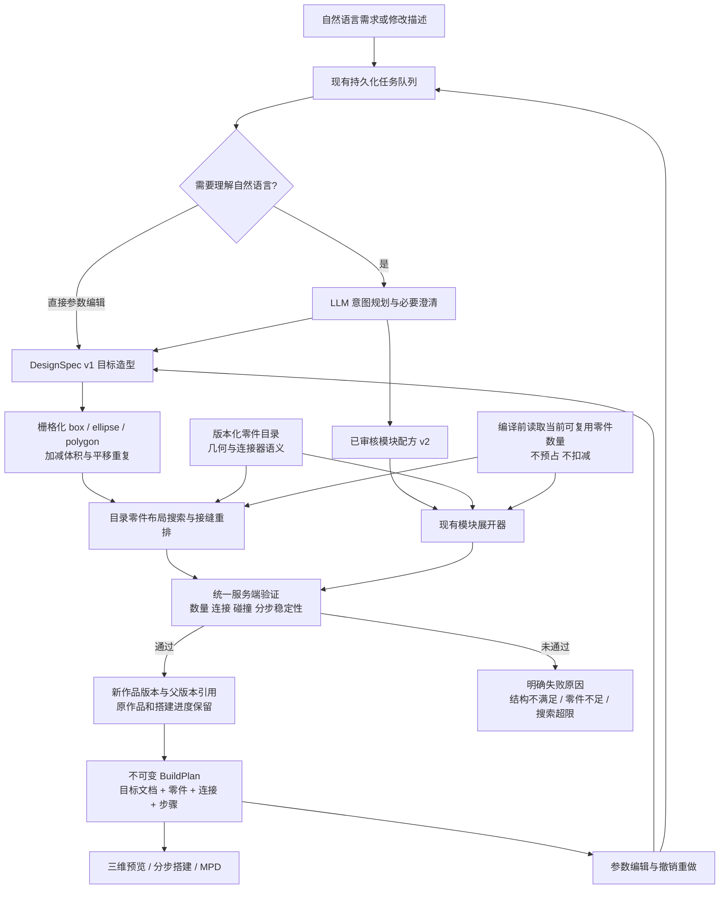
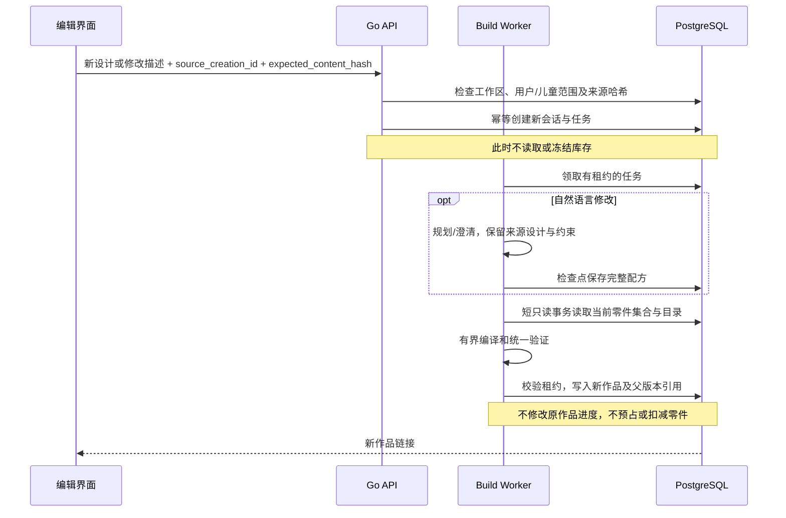

# 通用造型生成与结构化修订

本次实现把 Build Studio 从有限模块拼装扩展为「目标造型 → 真实零件布局 → 统一验证 → 可编辑作品」。现有模块继续提供经过审核的专用构造；静态物体不再因为没有同名模块而被拒绝。模块和通用形状目前分别编译，不能在一个 recipe 中混合。

零件按可重复利用的集合处理。生成不冻结、不预占、不扣减库存；已登记的数量只约束一个作品的用量。未登记集合时沿用现有自由设计模式；明确登记为空集合时不能凭空生成可搭建结果。

## 已实现的架构

实现复用现有 Go 服务、PostgreSQL 队列和 Web/Desktop 共享页面，没有新增微服务或外部求解器依赖。核心命令与接口放在 `packages/core`，编辑界面在 `packages/views`。移动端原生编辑界面不在本次改动中。

## 文档与编译契约

| 对象 | 内容与责任 |
| --- | --- |
| `AssemblyRecipe` v3 | 理解后的需求、限制和 `design`；不允许同时包含模块实例或模块限制。 |
| `DesignSpec` v1 | 静态目标体积。X/Z 使用积木凸点单位，Y 使用薄板单位；一块标准砖高 3 个薄板单位。 |
| `ShapeNode` | 稳定 ID、标签、类型、位置、尺寸、颜色；支持有序加减体积、局部多边形顶点与平移重复。 |
| `BuildPlan.document` | 目标设计、设计哈希、搜索报告、父作品 ID 与父物理内容哈希。 |
| `BuildPlan` | 权威物理布局、真实连接器连接、目录版本、步骤、验证结果、物理内容哈希。渲染和导出读取同一份布局。 |

尺寸修改改变目标体积；物理零件不能缩放，不能捏造零件 ID 或连接器。目标体积按 1 stud × 1 plate × 1 stud 采样。盒体、椭圆柱和任意局部多边形拉伸可以组合成不同静态轮廓；这里的圆是积木栅格近似，不是连续光滑曲面。

搜索只使用有审核语义、完整顶面和底面连接器的实体 `stud_tube_rect` 零件，使用 0/90 度水平朝向。逐格覆盖保持目标占位及特征归属；要求精确颜色时逐格颜色也保持。允许替色时，选择集合中存在的颜色，实际颜色记录在物理布局中。

搜索优先选择覆盖更多目标并连接已有组件的零件。断开的接缝通过小范围重铺修复，不能靠填掉孔洞或删除特征制造“成功”。最后仍进入现有连接器、碰撞、数量和分步稳定性验证器。

当前预算：最多 48 个形状、8192 个目标单元、200 个物理零件；栅格操作总量有界；全部搜索与局部修复合计最多 24000 个搜索节点，编译上下文最多 8 秒。搜索超限返回 `BUILD_SEARCH_LIMIT`；没有通过当前搜索和验证的布局，也不等于数学上证明不存在任何搭法。

## 修订与可复用零件

沿用 `POST /api/build/sessions`，新增可选的 `design`、`source_creation_id`、`expected_content_hash`。参数修改可以跳过 LLM；自然语言修改通过现有澄清和重试流程。来源哈希不符返回 409。每次成功生成新的 `build_creation`，搭建进度独立，原作品保持不变。

只读事务不跨越模型调用或编译。规划后会刷新可用零件读取；重试也重新读取。队列只固定配方和生成器版本，不固定库存。数据库既有 `inventory_snapshot` 非空列在新记录中存 `{}`，新计划不再写入旧的 `inventory` 字段；历史结果仍可读取。

编辑器提供形状选择、尺寸、位置、颜色、盒体/椭圆类型、增删、撤销/重做和自然语言修改。多边形顶点、加减操作与重复模式可由设计 API 或自然语言表达，当前表单没有专用操作控件。表单修改后提交编译，成功才展示新的三维结果；没有把未验证草稿冒充可搭建作品。

## 本地验证

- Go 编译器测试覆盖时钟、圆环孔洞、多边形拉伸、矩形面和重复结构；比较每个目标单元的归属、颜色、占位，验证确定性哈希与 MPD。
- 约束测试覆盖精确数量、尺寸修改、每次可重复使用同一批零件、数量不足、非法设计、取消与搜索预算。
- 隔离 PostgreSQL 测试验证排队后修改零件数量会生效；重复请求幂等，来源哈希冲突，生成不消费零件，新旧作品及原搭建进度互不覆盖。队列、租约、取消、澄清和历史响应兼容测试带 `-race` 执行。
- Core 命令测试覆盖撤销/重做、无效修改和旧响应兼容；Web 浏览器测试使用真实 HTTP/数据库/队列/编译器，覆盖时钟、参数修订、移动宽度和自然语言澄清修订。
- 浏览器使用确定性本地模型替身；它验证集成链路，不能证明真实模型理解所有物体的成功率。开启 `CHIMII_BUILD_WEBGL_TEST=1` 要求实际 GLB 渲染成功。

运行命令和隔离环境要求见 `server/internal/build/README.md`。未部署生产、未进行真实零件搭建或力学实验。

2026-09-05 本地验收结果：`internal/build` 与 `internal/ldrawsync` 包测试、Build handler 隔离数据库竞态测试、Core 62 项相关测试、Views 5 项相关测试、Core/Views 类型检查，以及两个 Playwright 流程通过。Lint 无错误，Views 有 15 项现有警告。全库 Core 检查中另有现有 `diagnostics/diagnostic-context.test.ts` 的 circuit 路由识别测试失败，该文件及路由诊断实现不属于本次修改，未将全库检查报告为通过。

## 后续扩展接口与边界

| 能力 | 当前状态 | 后续落点 |
| --- | --- | --- |
| 新静态轮廓 | 已实现通用造型编译；可行性受目录、尺寸和预算限制 | 更多参数化曲面/离散方向、更强布局搜索与语义验收样本 |
| 结构化修订 | 已实现参数、自然语言、撤销/重做、新版本与原进度保留 | 三维选择/拖拽、草稿预览、局部固定约束与版本比较 |
| 图片/草图到造型 | 未实现 | 输入提供者生成同一 `DesignSpec`，仍须经过目录编译和验证 |
| 活动机构 | 保留既有认证轮子模块；未实现通用机构求解或真实走时钟表 | 新增关节/自由度契约、运动与干涉验证，接入共享权威文档 |
| 新制造零件 | 未实现 | 独立设计、工艺与审核流程；审核后的零件注册进版本目录，再参与搭建 |

这次解除的是“物体名称必须在模块名单里”的限制。有限零件集合、离散方向和有限搜索预算下，不能承诺任意连续形状或任意机械功能都有可搭建解；静态造型、机构能力和制造新零件应分别给出可验证的能力声明。
